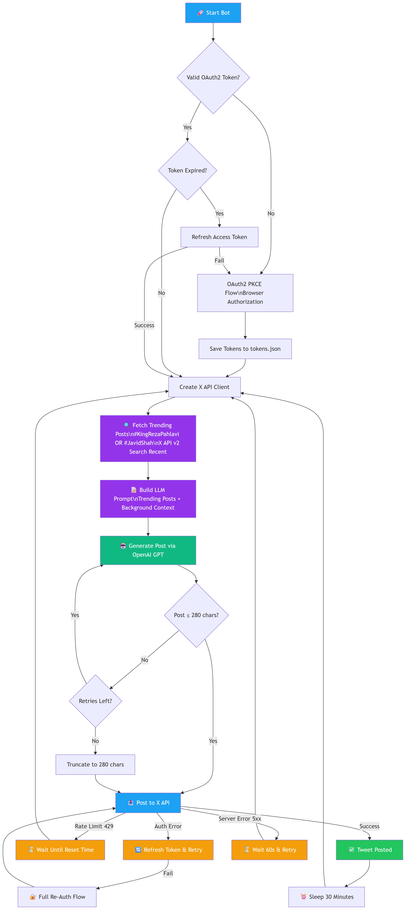

# X Iran Awareness Bot

An automated X (Twitter) bot that uses LLM to generate and post Iran awareness content on a scheduled basis. It fetches trending posts about **#KingRezaPahlavi** and **#JavidShah** from X as real-time context for content generation, ensuring posts are timely and relevant to the ongoing conversation.

## Pipeline



## Features

- 🤖 **LLM-Powered Content Generation** — Uses OpenAI GPT models to generate impactful posts about Iran awareness
- 🔍 **Trending Context** — Fetches the latest 10 posts about #KingRezaPahlavi and #JavidShah from X to inform content generation
- 🔐 **OAuth2 PKCE Authentication** — Secure authentication flow with automatic token management
- 🔄 **Automatic Token Refresh** — Handles token expiration and refresh automatically
- ⏰ **Scheduled Posting** — Posts content every 30 minutes automatically
- 🛡️ **Error Handling** — Rate limit detection, token refresh retry, re-auth fallback, and server error recovery
- 🌐 **Browser-Based Auth** — Seamless OAuth flow with automatic browser opening

## Prerequisites

- Python 3.13 or higher
- X (Twitter) Developer Account with API access
- OpenAI API key
- `uv` package manager (recommended) or `pip`

## Installation

1. **Clone the repository:**
   ```bash
   git clone <repository-url>
   cd X_bot
   ```

2. **Install dependencies using `uv` (recommended):**
   ```bash
   uv sync
   ```

   Or using `pip`:
   ```bash
   pip install -e .
   ```

## Configuration

1. **Create a `.env` file in the project root:**
   ```env
   # X (Twitter) API Credentials
   X_CLIENT_ID=your_client_id_here
   X_CLIENT_SECRET=your_client_secret_here
   X_REDIRECT_URI=http://127.0.0.1:8080/callback

   # OpenAI
   OPENAI_API_KEY=your_openai_api_key_here
   OPENAI_MODEL=gpt-4o
   ```

2. **Get X API Credentials:**
   - Go to [X Developer Portal](https://developer.twitter.com/)
   - Create a new app or use an existing one
   - Generate OAuth 2.0 credentials (Client ID and Client Secret)
   - Set the redirect URI to match `X_REDIRECT_URI` in your `.env` file

3. **Get OpenAI API Key:**
   - Sign up at [OpenAI](https://platform.openai.com/)
   - Generate an API key from your account settings

## Usage

1. **Run the bot:**
   ```bash
   uv run python main.py
   ```

2. **First-time Authorization:**
   - The bot will automatically open your browser for X authorization
   - Complete the OAuth flow in the browser
   - The authorization tokens will be saved to `tokens.json`
   - You can close the browser tab after authorization

3. **Automatic Operation:**
   - The bot fetches trending posts about #KingRezaPahlavi and #JavidShah
   - Generates a context-aware post using the LLM
   - Posts it to X
   - Waits 30 minutes and repeats

## Project Structure

```
X_bot/
├── main.py              # Entry point, OAuth flow, token management, main loop
├── llms/
│   ├── llm.py           # OpenAI GPT content generation with trending context
│   └── prompts.py       # System/user prompts and trending context builder
├── pyproject.toml       # Project dependencies and metadata
├── pipeline.png         # Pipeline diagram
├── tokens.json          # Saved OAuth tokens (generated at runtime, gitignored)
├── .env                 # Environment variables (create this, gitignored)
└── README.md
```

## How It Works

1. **Authentication** — OAuth2 PKCE flow via browser, tokens persisted in `tokens.json` with automatic refresh
2. **Trending Fetch** — Searches X API v2 for recent posts matching `(#KingRezaPahlavi OR #JavidShah) lang:en`
3. **Content Generation** — Trending posts are injected as primary context into the LLM prompt alongside background context about the Iranian freedom movement
4. **Posting** — Generated post is validated (≤280 chars) and posted via X API
5. **Error Recovery** — Rate limits (429), auth errors (401/403), and server errors (5xx) are each handled with appropriate retry strategies

## Troubleshooting

### Bot gets stuck when opening browser
- The bot includes a 5-minute timeout for OAuth callbacks
- If authorization takes too long, the bot will show an error message
- Simply restart the bot and complete the authorization quickly

### Token expiration errors
- The bot automatically handles token refresh
- If refresh fails, it will re-authenticate automatically
- Old tokens are cleared and a new OAuth flow is initiated

### LLM generation fails
- The bot includes a fallback message if LLM generation fails
- Check your OpenAI API key and account balance
- Ensure you have internet connectivity

### Port already in use
- Change the `X_REDIRECT_URI` in your `.env` to use a different port
- Update the redirect URI in your X Developer Portal app settings

## Key Dependencies

- **[xdk](https://pypi.org/project/xdk/)** — X API client library (OAuth2, posts, search)
- **[openai](https://pypi.org/project/openai/)** — OpenAI Python SDK for content generation
- **[python-dotenv](https://pypi.org/project/python-dotenv/)** — Loads `.env` configuration

## License

See the [LICENSE](LICENSE) file for details.

## Disclaimer

This bot is designed for awareness purposes. Ensure you comply with X/Twitter's Terms of Service and API usage policies. Use responsibly and respect rate limits.
